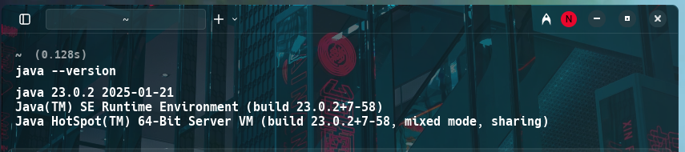
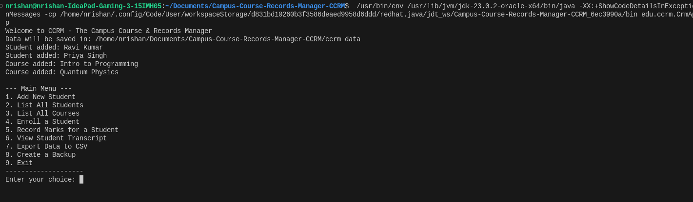
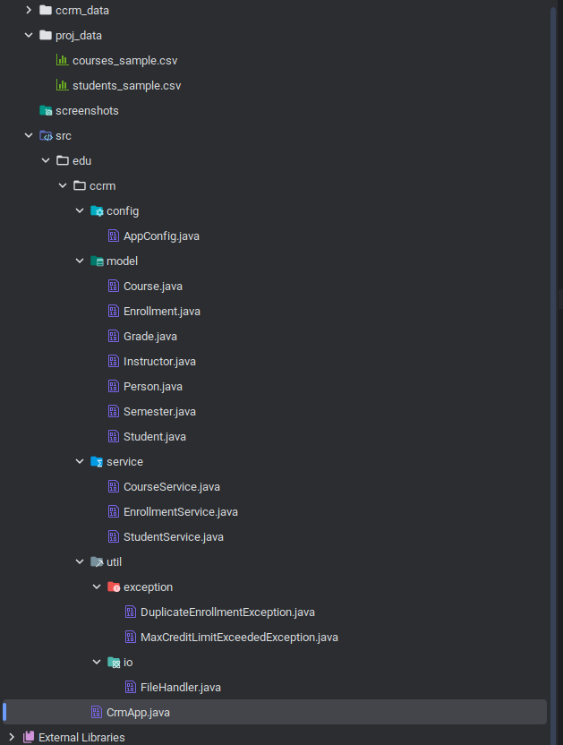
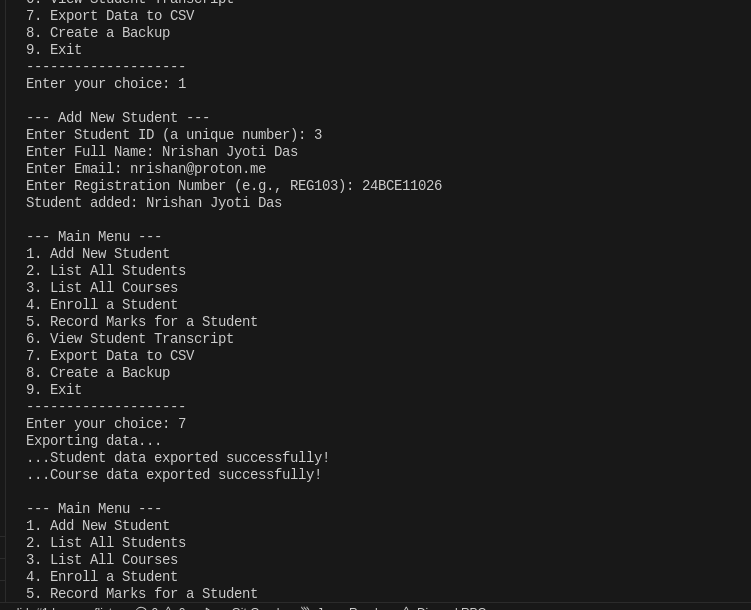

<h1 align="center">
  <br>
  Campus Course & Records Manager (CCRM)
  <br>
</h1>

<p align="center">
  <a href="https://github.com/njd07/Campus-Course-Records-Manager-CCRM">
    
  </a>
  <a href="https://github.com/njd07/Campus-Course-Records-Manager-CCRM/issues">
    
  </a>
  <a href="https://github.com/njd07/Campus-Course-Records-Manager-CCRM/stargazers">
    
  </a>
</p>

<p align="center">
  <a href="#key-features">Key Features</a> •
  <a href="#requirements">Requirements</a> •
  <a href="#how-to-use">Build & Run</a> •
  <a href="#project-structure">Project Structure</a> •
  <a href="#-evolution-of-java">Evolution of Java</a> •
  <a href="#java-me-vs-se-vs-ee">Java ME vs SE vs EE</a> •
  <a href="#jdk-jre-jvm-explained">JDK, JRE, JVM</a> •
  <a href="#-mapping-syllabus--implementation">Mapping Syllabus → Implementation</a> •
  <a href="#install-on-windows">Install on Windows</a> •
  <a href="#screenshots">Screenshots</a>
</p>

---

## Project Statement

Design and implement a console-based Java application called **Campus Course & Records Manager (CCRM)** that lets an institute manage:

- Students (create/update, enroll/unenroll in courses, print transcripts)
- Courses (create/update, list, search, assign instructors)
- Grades & Transcripts (record marks, compute GPA, generate transcript view)
- File Utilities (import/export CSV, backup course data with recursion)
- Console Menu System (menu-driven workflow for all operations)

This is a **Java SE project** built and run locally. It demonstrates OOP principles (Encapsulation, Inheritance, Abstraction, Polymorphism), Exception Handling, Java I/O (NIO.2 + Streams), Date/Time API, functional interfaces & lambdas, recursion, enums, and design patterns (Singleton, Builder).

---

## Key Features

- **Student Management** – add/list/update/deactivate students, print transcript
- **Course Management** – create/list/update courses, search/filter by instructor/semester/department
- **Enrollment & Grading** – enroll/unenroll, enforce max credits, record marks, compute GPA
- **Import/Export CSV** – import student/course data, export records, backup with timestamped folders
- **CLI Menu System** – simple interactive menu for all operations
- **Advanced Java** – Streams, Lambdas, Enums, Custom Exceptions, Design Patterns

---

## Requirements
- JDK 17+
- IDE: IntelliJ IDEA / Eclipse

---

## How To Use

```bash
# Clone this repository
git clone https://github.com/njd07/Campus-Course-Records-Manager-CCRM.git

# Go into the project directory
cd Campus-Course-Records-Manager-CCRM

# Compile the program
javac src/edu/ccrm/CrmApp.java

# Run the program
java -cp src edu.ccrm.CrmApp
```

Sample CSV data files are available inside `proj_data/`.

---

## Project Structure

```
Campus-Course-Records-Manager-CCRM/
├── ccrm_data/
│   ├── courses_export.csv
│   └── students_export.csv
├── proj_data/
│   ├── courses_sample.csv
│   └── students_sample.csv
├── screenshots/
│   ├── file_struct.png
│   ├── java_version_check.png
│   ├── menu.png
│   └── menu_test.png
├── src/edu/ccrm
│   ├── config/
│   │   └── AppConfig.java
│   ├── model/
│   │   ├── Course.java
│   │   ├── Enrollment.java
│   │   ├── Grade.java
│   │   ├── Instructor.java
│   │   ├── Person.java
│   │   ├── Semester.java
│   │   └── Student.java
│   ├── service/
│   │   ├── CourseService.java
│   │   ├── EnrollmentService.java
│   │   └── StudentService.java
│   ├── util/
│   │   ├── exception/
│   │   │   ├── DuplicateEnrollmentException.java
│   │   │   └── MaxCreditLimitExceededException.java
│   │   └── io/
│   │       └── FileHandler.java
│   └── CrmApp.java
├── README.md
└── Usage.md
```

---

## 🕰 Evolution of Java

* **1995**: Java 1.0 – Write once, run anywhere
* **1998**: Java 2 (J2SE, J2EE, J2ME introduced)
* **2004**: Java 5 (Generics, Annotations, Enums)
* **2014**: Java 8 (Streams, Lambdas, Date/Time API)
* **2017**: Java 9 (Modules)
* **2021–2025**: Java 17, 21 LTS – Records, Sealed Classes, Pattern Matching

---

## Java ME vs SE vs EE

| Edition                     | Purpose                                   | Example Use Cases                              |
| --------------------------- | ----------------------------------------- | ---------------------------------------------- |
| **ME (Micro Edition)**      | Lightweight, resource-constrained devices | Embedded systems, feature phones               |
| **SE (Standard Edition)**   | Core Java libraries + APIs                | Desktop apps, CLI apps (like CCRM)             |
| **EE (Enterprise Edition)** | Adds web, enterprise APIs                 | Servlets, JSP, Jakarta EE, enterprise backends |

---

## JDK, JRE, JVM Explained

* **JVM** (Java Virtual Machine): Executes compiled bytecode
* **JRE** (Java Runtime Environment): JVM + libraries to *run* apps
* **JDK** (Java Development Kit): JRE + compiler + dev tools to *build* apps

---

## 📑 Mapping Syllabus → Implementation

| Syllabus Topic                                 | Where in Project                                                            |
| ---------------------------------------------- | --------------------------------------------------------------------------- |
| OOP (Encapsulation, Inheritance, Polymorphism) | `Student.java`, `Instructor.java`, `Course.java`, `Person.java`             |
| Abstraction (interfaces)                       | `service/StudentService.java`, `CourseService.java`                         |
| Packages                                       | `edu.ccrm.model`, `edu.ccrm.service`, `edu.ccrm.util`                       |
| Exception Handling                             | `DuplicateEnrollmentException.java`, `MaxCreditLimitExceededException.java` |
| Collections Framework                          | `CourseService.java` and `EnrollmentService.java`                           |
| Generics                                       | Service methods with `List<Student>` and `List<Course>`                     |
| I/O (File, NIO.2)                              | `FileHandler.java`                                                          |
| Threads/Concurrency                            | Backups and File operations with NIO.2                                      |
| Date/Time API                                  | `Enrollment.java` uses `LocalDate`                                          |
| Assertions                                     | Invariants in constructors (`assert id > 0`)                                |
| Design Patterns                                | Singleton: `AppConfig.java`                                                 |

---

# Install on Windows

1. Download **JDK 17** from [Oracle](https://www.oracle.com/java/technologies/downloads/).
2. Install and set environment variables:

    * `JAVA_HOME=C:\Program Files\Java\jdk-17`
    * Add `%JAVA_HOME%\bin` to `PATH`
3. Verify installation:

   ```
   java -version
   javac -version
   ```
4. Install **Eclipse IDE** or **IntelliJ IDEA**
5. Import project and run `CrmApp.java`

---

## Screenshots

### 1. Java installation verification



### 2. Project menu



### 3. Project file structure



### 4. Sample menu test




<h3 align="center">✨ THANK YOU FOR CHECKING OUT THE PROJECT! ✨</h3> <p align="center">Feel free to open issues or contribute via pull requests.</p> 
