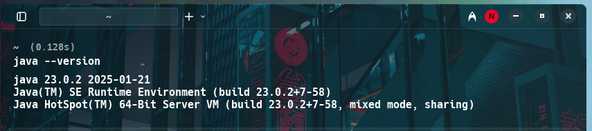
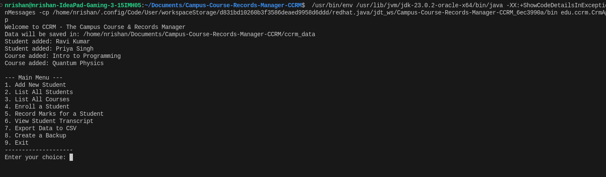
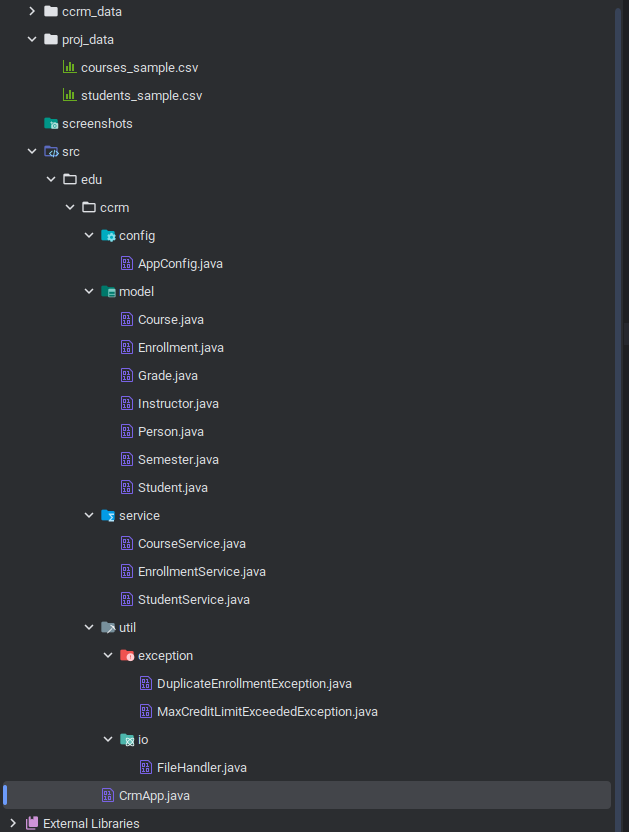
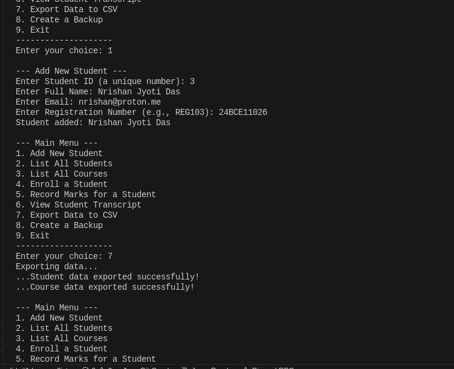

<h1 align="center">
  <br>
  🎓 Campus Course &amp; Records Manager (CCRM)
  <br>
</h1>

<p align="center">
  A console-based Java SE application for managing students, courses, enrollments, grades &amp; transcripts.
</p>

<p align="center">
  <a href="https://github.com/shreyasdas2006-web/Campus-Course-Records-Manager-CCRM-">
    
  </a>
  
  
  
  <a href="https://github.com/shreyasdas2006-web/Campus-Course-Records-Manager-CCRM-/issues">
    
  </a>
  <a href="https://github.com/shreyasdas2006-web/Campus-Course-Records-Manager-CCRM-/stargazers">
    
  </a>
</p>

<p align="center">
  <a href="#-project-statement">Project Statement</a> •
  <a href="#-key-features">Key Features</a> •
  <a href="#-requirements">Requirements</a> •
  <a href="#-build--run">Build &amp; Run</a> •
  <a href="#-project-structure">Project Structure</a> •
  <a href="#-oop--design-patterns">OOP &amp; Design Patterns</a> •
  <a href="#-advanced-java-features">Advanced Java</a> •
  <a href="#-grading-system">Grading System</a> •
  <a href="#-syllabus-mapping">Syllabus Mapping</a> •
  <a href="#-java-editions--jdk-explained">Java Editions</a> •
  <a href="#-screenshots">Screenshots</a>
</p>

---

## 📋 Project Statement

Design and implement a **console-based Java application** called **Campus Course &amp; Records Manager (CCRM)** that lets an institute manage:

- 👤 **Students** — add, list, update, enroll/unenroll, print transcripts
- 📚 **Courses** — create, list, update, search, assign instructors
- 🏆 **Grades &amp; Transcripts** — record marks, compute GPA, generate transcript view
- 💾 **File Utilities** — export CSV, backup course data with timestamped folders
- 🖥️ **Console Menu System** — menu-driven workflow for all operations

This is a **Java SE project** built and run locally. It demonstrates OOP principles (Encapsulation, Inheritance, Abstraction, Polymorphism), Exception Handling, Java I/O (NIO.2), Date/Time API, Streams &amp; Lambdas, Enums, and Design Patterns (Singleton, Builder).

---

## ✨ Key Features

| Feature | Description |
|---|---|
| 👤 **Student Management** | Add, list students; auto-seeded with sample data on startup |
| 📚 **Course Management** | Create &amp; list courses; search/filter by instructor, semester, code |
| 📝 **Enrollment System** | Enroll students; enforce max-credit cap (21 credits) per student |
| 🎯 **Marks &amp; Grading** | Record marks (0–100); auto-convert to grade (S/A/B/C/D/F) |
| 📄 **Transcript &amp; GPA** | View full academic transcript with computed cumulative GPA |
| 💾 **CSV Export** | Export student &amp; course data to structured CSV files |
| 🔒 **Backup System** | One-click backup with auto-generated timestamped folders |
| ⚠️ **Custom Exceptions** | Business-rule exceptions for duplicate enrollment &amp; credit overload |
| 🏗️ **Design Patterns** | Singleton (`AppConfig`) + Builder (`Course`) patterns |

---

## ⚙️ Requirements

| Requirement | Specification |
|---|---|
| **JDK** | Java 17 or higher (LTS) |
| **IDE** | IntelliJ IDEA / Eclipse (recommended) |
| **OS** | Windows / macOS / Linux |
| **Build Tool** | Manual `javac` (no Maven/Gradle needed) |
| **Dependencies** | None — 100% standard Java SE |

---

## 🚀 Build &amp; Run

```bash
# 1. Clone this repository
git clone https://github.com/shreyasdas2006-web/Campus-Course-Records-Manager-CCRM-.git

# 2. Go into the project directory
cd Campus-Course-Records-Manager-CCRM-

# 3. Compile from the project root
javac -d out -sourcepath src src/edu/ccrm/CrmApp.java

# 4. Run the application
java -cp out edu.ccrm.CrmApp
```

> 💡 Sample CSV data files for testing are available inside `proj_data/`.

### Install JDK on Windows

1. Download **JDK 17+** from [Oracle](https://www.oracle.com/java/technologies/downloads/)
2. Set environment variables:
   - `JAVA_HOME = C:\Program Files\Java\jdk-17`
   - Add `%JAVA_HOME%\bin` to `PATH`
3. Verify: `java -version` and `javac -version`
4. Open the project in **IntelliJ IDEA** or **Eclipse** and run `CrmApp.java`

---

## 📁 Project Structure

```
Campus-Course-Records-Manager-CCRM-/
│
├── src/edu/ccrm/                       ← Main source root
│   ├── CrmApp.java                     ← Entry point & console menu
│   ├── config/
│   │   └── AppConfig.java              ← Singleton: central in-memory data store
│   ├── model/                          ← Domain entity classes
│   │   ├── Person.java                 ← Abstract base class (id, name, email)
│   │   ├── Student.java                ← Extends Person; holds enrolled courses
│   │   ├── Instructor.java             ← Extends Person; adds department
│   │   ├── Course.java                 ← Builder pattern; code, title, credits
│   │   ├── Enrollment.java             ← Links Student ↔ Course with grade & date
│   │   ├── Grade.java                  ← Enum: S/A/B/C/D/F with grade points
│   │   └── Semester.java               ← Enum: FALL, SPRING, SUMMER
│   ├── service/                        ← Business logic layer
│   │   ├── StudentService.java         ← Add, find, list students
│   │   ├── CourseService.java          ← Add, find, list courses
│   │   └── EnrollmentService.java      ← Enroll, grade, GPA, transcript
│   └── util/
│       ├── exception/
│       │   ├── DuplicateEnrollmentException.java
│       │   └── MaxCreditLimitExceededException.java
│       └── io/
│           └── FileHandler.java        ← CSV export, backup, folder size (NIO.2)
│
├── ccrm_data/                          ← Runtime-generated export files
│   ├── students_export.csv
│   └── courses_export.csv
├── proj_data/                          ← Sample seed data for testing
│   ├── students_sample.csv
│   └── courses_sample.csv
├── screenshots/                        ← App screenshots
├── Project_Report.md                   ← Full project report
├── Usage.md                            ← Step-by-step usage guide
└── README.md                           ← This file
```

---

## 🧱 OOP &amp; Design Patterns

### Inheritance Hierarchy

```
Person  (abstract)
├── Student      → adds regNo, enrolledCourses list
└── Instructor   → adds department
```

### Four Pillars of OOP

| Principle | Implementation |
|---|---|
| **Encapsulation** | All model fields are `private` with public getters/setters |
| **Inheritance** | `Student` and `Instructor` both extend abstract `Person` |
| **Abstraction** | `Person` defines abstract `getDetails()` — subclasses must implement |
| **Polymorphism** | `getDetails()` behaves differently in `Student` vs `Instructor` |

### Design Patterns

#### 🔒 Singleton — `AppConfig`
Ensures a single shared in-memory data store (students, courses, enrollments, instructors) across all service classes:

```java
public static AppConfig getInstance() {
    if (instance == null) instance = new AppConfig();
    return instance;
}
```

#### 🔨 Builder — `Course`
Enables clean, readable object construction without telescoping constructors:

```java
Course c1 = new Course.Builder("CS101")
        .title("Intro to Programming")
        .credits(4)
        .semester(Semester.FALL)
        .instructor(profGupta)
        .build();
```

---

## ⚡ Advanced Java Features

| Feature | Where Used |
|---|---|
| **Generics** | `List<Student>`, `List<Course>`, `List<Enrollment>` in all service classes |
| **Collections (ArrayList)** | Dynamic in-memory storage of all runtime data |
| **Enums** | `Grade` (with `fromMarks()` + grade points), `Semester` |
| **Streams &amp; Lambdas** | `findStudentById()`, `findCourseByCode()` using `filter().findFirst()` |
| **Date/Time API** | `LocalDate` used in `Enrollment` for enrollment date |
| **Java NIO.2** | `Path`, `Paths`, `Files` in `FileHandler.java` for all file ops |
| **Custom Exceptions** | `DuplicateEnrollmentException`, `MaxCreditLimitExceededException` |
| **Assertions** | Constructor-level invariant checks (`assert id > 0`) |
| **Recursion** | `getFolderSize()` recursively walks the backup directory tree |

---

## 🎓 Grading System

Marks are converted automatically to a letter grade using the `Grade` enum:

| Grade | Marks Range | Grade Points |
|-------|-------------|:------------:|
| **S** | 90 – 100    | 10.0         |
| **A** | 80 – 89     | 9.0          |
| **B** | 70 – 79     | 8.0          |
| **C** | 60 – 69     | 7.0          |
| **D** | 50 – 59     | 6.0          |
| **F** | Below 50    | 0.0          |

**GPA Formula:**
```
GPA = Σ (Grade Points × Course Credits) / Σ Course Credits
```

---

## 🖥️ Console Menu

```text
--- Main Menu ---
1. Add New Student
2. List All Students
3. List All Courses
4. Enroll a Student
5. Record Marks for a Student
6. View Student Transcript
7. Export Data to CSV
8. Create a Backup
9. Exit
--------------------
Enter your choice:
```

**Typical workflow:**
1. **Add student** → Option `1`
2. **Enroll in course** → Option `4`
3. **Record marks** → Option `5`
4. **View transcript &amp; GPA** → Option `6`
5. **Export &amp; backup** → Options `7` / `8`

> See [`Usage.md`](Usage.md) for a detailed step-by-step walkthrough with sample console output.

---

## 📑 Syllabus Mapping

| Syllabus Topic | Implementation in CCRM |
|---|---|
| OOP – Encapsulation | Private fields + getters/setters in all model classes |
| OOP – Inheritance | `Student`, `Instructor` extend `Person` |
| OOP – Abstraction | Abstract class `Person` with abstract `getDetails()` |
| OOP – Polymorphism | Overridden `getDetails()` in `Student` and `Instructor` |
| Packages | `edu.ccrm.model`, `edu.ccrm.service`, `edu.ccrm.util` |
| Exception Handling | `DuplicateEnrollmentException`, `MaxCreditLimitExceededException`; try-catch throughout |
| Collections Framework | `ArrayList<>` in `AppConfig`, services |
| Generics | `List<Student>`, `List<Course>`, `List<Enrollment>` |
| Enums | `Grade` (with methods), `Semester` |
| Streams &amp; Lambdas | Student/Course search using `stream().filter().findFirst()` |
| Date/Time API | `LocalDate enrollmentDate` in `Enrollment.java` |
| File I/O (NIO.2) | `FileHandler.java` — CSV export, backup, `Files.walk()` |
| Recursion | `getFolderSize()` walks directory tree recursively |
| Assertions | Constructor invariants (`assert id > 0`) |
| Design Pattern – Singleton | `AppConfig.getInstance()` |
| Design Pattern – Builder | `Course.Builder` |

---

## ☕ Java Editions & JDK Explained

### Java ME vs SE vs EE

| Edition | Purpose | Example Use Cases |
|---|---|---|
| **ME** (Micro Edition) | Lightweight, resource-constrained devices | Embedded systems, feature phones |
| **SE** (Standard Edition) | Core Java libraries + APIs | Desktop apps, CLI apps **(like CCRM)** |
| **EE** (Enterprise Edition) | Adds web &amp; enterprise APIs | Servlets, JSP, Jakarta EE backends |

### JDK → JRE → JVM

```
JDK  (Java Development Kit)
 └─ JRE  (Java Runtime Environment)
     └─ JVM  (Java Virtual Machine)
```

- **JVM** — Executes compiled `.class` bytecode on any OS
- **JRE** — JVM + standard libraries to *run* Java apps
- **JDK** — JRE + `javac` compiler + dev tools to *build* Java apps

### 🕰 Evolution of Java

| Year | Milestone |
|---|---|
| 1995 | Java 1.0 — "Write once, run anywhere" |
| 1998 | Java 2: J2SE, J2EE, J2ME introduced |
| 2004 | Java 5 — Generics, Annotations, Enums |
| 2014 | Java 8 — Streams, Lambdas, Date/Time API |
| 2017 | Java 9 — Module system (Jigsaw) |
| 2021 | Java 17 LTS — Records, Sealed Classes |
| 2023 | Java 21 LTS — Pattern Matching, Virtual Threads |

---

## 📸 Screenshots

### 1. Java Installation Verification


### 2. Application Main Menu


### 3. Project File Structure


### 4. Sample Menu Test


---

## 📄 Documentation

| File | Description |
|---|---|
| [`README.md`](README.md) | This file — project overview &amp; reference |
| [`Usage.md`](Usage.md) | Step-by-step usage walkthrough with console output examples |
| [`Project_Report.md`](Project_Report.md) | Full academic project report (17 sections) |

---

<h3 align="center">✨ Thank you for checking out CCRM! ✨</h3>
<p align="center">Feel free to open issues or contribute via pull requests.</p>
